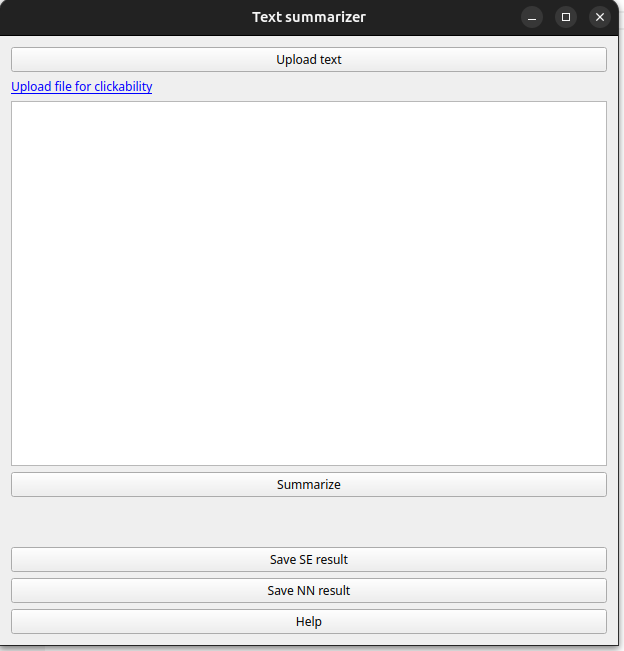

# Text summarization app

Text summarization GUI app with PyQT5. Summarization works in two different methods - network based method and page rank method. 

## Usage

To run app execute following commands:

```bash
pip install -r requirements.txt  # for pip
python main.py
```
Then you will see interface similar below



## About summarization methods

Neural network method is based on receiving responses from huggingface API. For english documents [bart large cnn](https://huggingface.co/facebook/bart-large-cnn) is used and for other languages documents - [mT5](https://huggingface.co/csebuetnlp/mT5_multilingual_XLSum). 

Sentense extraction method is based on sentence tokenization, sentence similarity matrix and [PageRank](https://en.wikipedia.org/wiki/PageRank) algorithm. Similarity matrix is creating by cosine metric from nltk library.  

